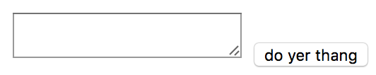
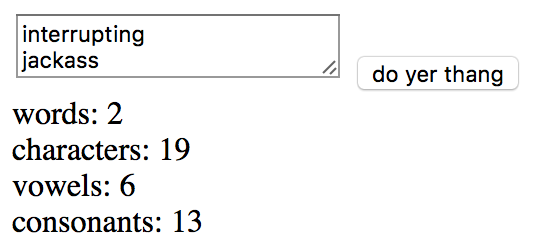

# ServEric

Here's a really simple Python HTTP server that has an HTML UI using CSS for
style and a bit of Javascript linking the two together. Trying to show the
possibilities, not winning any beauty contests.

Run it like:

```
> python main.py
```

Then, point your browser at http://localhost:8080/

You will see something like:


Type words in the box. One per line. Click "do yer thang" and you should see:

